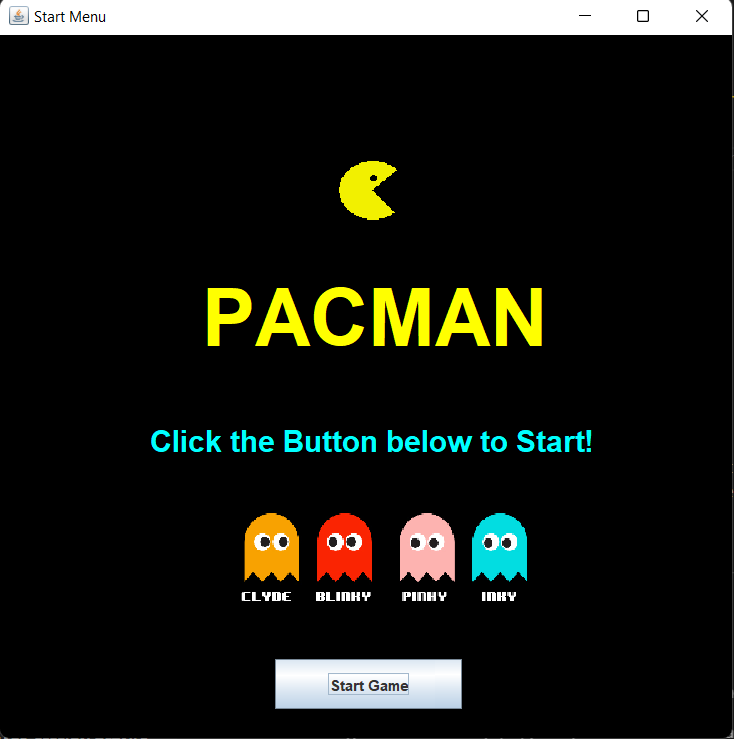

# Project 1: PacMan


<!--  -->

###### Members: Jacob Zohdi, Maria Mao, Neha Shijo, Soyoung Hong

## Running Code from the Command Line

```shell
$ javac -cp "src/" src/*.java
$ java -cp "src/" StartMenu
```

## PacMan Class

#### **get_valid_moves()**

This method returns at most the four directions that Pacman can move (up, down, left, right). If there is a wall occupying that direction however, then this is not a valid move. Since the map is surrounded by walls in all directions, we an assume it is always Wall type or some other valid object in that direction. Test added to check when Pacman is in a corner, this function returns the two possible directions.

#### **move()**

This method uses get_valid_moves() to find the possible locations that a Pacman can move to from its current location. It then moves it to the first possible location returned by get_valid_moves(). If the pacman can move, the method returns true, otherwise, it returns false. For the test, I created a Pacman object, then called get_valid_moves(), and moved the pacman using move() to the first valid move if there were any valid moves. I tested that the move correctly moved the pacman to one of the valid moves. I did this a second time to test that another move would also return the correct result.

#### **is_ghost_in_range()**

The method checks if there is a ghost in range by checking whether the hash set at the indicated locations adjacent to Pacman contain the type "GHOST".
The test is simple; we place Pacman at (0, 0) and a ghost at (1, 0). The test should return true, as the ghost is one above Pacman.

#### **consume()**

The method simply calls the eatCookie() function from the Map class. The eatCookie() function does the work of checking to see if there is a 'power-cookie' located in Pacman's current (x,y) coordinate, and returns null if not.

## Ghost Class

#### **get_valid_moves()**

The method checks if the adjacent Locations contain the type "WALL". The ones that don't are added to the ArrayList of Locations.
In the test, a ghost is surrounded by three ghosts and Pacman. In this case, because ghosts can move through anything that isn't a wall, the output should contain all four Locations of the other objects.

#### **move()**

This method uses get_valid_moves() to find the possible locations that a Ghost can move to from its current location. It then moves it to the first possible location returned by get_valid_moves(). If the ghost can move, the method returns true, otherwise, it returns false. For the test, I created a Ghost object, then called get_valid_moves(), and moved the ghost using move() to the first valid move if there were any valid moves. I tested that the move correctly moved the ghost to one of the valid moves. I did this a second time to test that another move would also return the correct result.

#### **is_pacman_in_range()**

This method checks 4 directions around the ghost (up, down, left, right) for Pacman and returns true if found, else returns false.
Ghost will call, starting with the up direction`new Location(x+ 1, y)`, `Map.getLoc()` and check if the `HashetSet<Map.Type>` contains `Map.Type.Pacman`. If not then repeats this for right, down, then left. Returns false if none contain Pacman.
For testing, a `Ghost` is added to the `MainFrame` and the function is called when Pacman is inserting next to the ghost or not.

#### **attack()**

This function checks if PacMan is in the range of ghost. If it is, it calls the attack function of map and returns True. If not, it simply returns False.

## Map Class

#### **move(String name, Location loc, Type type)**

This method puts the object specified by the name at the location in the parameter. It returns true if it is able to move the object, and false otherwise. For the test, I got the valid moves for a Pacman, moved it to the first valid move through move, and tested that the move returned true.

#### **getLoc(Location loc)**

This method uses the `field` member and simply returuns null if the location given is not in the field. The `field` member will return valid objects in the location. Method returns `HashSet<Map.Type>`. Test added with instantiated the Map class based on frame code and then adding objects to different locations while checking the objects are returned correctly.

#### **attack(String name)**

The method takes the name of a ghost and checks whether that ghost is adjacent to Pacman. If it is, then the attack method updates the gameOver variable and ends the game.
The test sets a ghost and Pacman adjacent to each other. The method should return true and the gameOver variable is set to true as a result. In turn, this should end the game.

#### **eatCookie(String Name)**

This method gets the location where a given cookie is located, and removes the cookie from the field. It increments the counter of cookies eaten by 1, and returns the cookie component eaten (or null).
